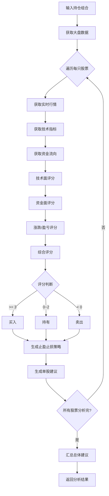

# 股票分析策略

## 整体流程



---

## 1. 技术面分析

### 1.1 均线分析

```
┌─────────────────────────────────────────────────────────────┐
│                      均线多头排列                            │
│                                                             │
│    价格                                                    │
│      ▲                                                    │
│      │    ╱ ╱ ╱  MA5 (5日均线)                             │
│      │  ╱      ╱  MA10 (10日均线)                         │
│      │╱        ╱   MA20 (20日均线)                         │
│      └─────────────→ 时间                                  │
│                                                             │
│    条件: MA5 > MA10 > MA20                                 │
│    得分: +2                                                │
│    结论: 短期强势，看涨信号                                 │
└─────────────────────────────────────────────────────────────┘
```

| 形态 | 条件 | 分数 | 含义 |
|------|------|------|------|
| 多头排列 | ma5 > ma10 > ma20 | +2 | 看涨 |
| 空头排列 | ma5 < ma10 < ma20 | -2 | 看跌 |
| 其他 | - | 0 | 中性 |

### 1.2 MACD指标

```
┌─────────────────────────────────────────────────────────────┐
│                        MACD金叉                            │
│                                                             │
│    数值                                                   │
│      ▲                                                    │
│      │    ╱──╱  DIF (快线)                                 │
│      │  ╱──    DEA (慢线)                                  │
│      │╱                                                    │
│      └─────────────→ 时间                                  │
│          ↑                                                │
│        金叉点                                              │
│                                                             │
│    条件: DIF 从下往上穿过 DEA                              │
│    得分: histogram > 0 时 +1                               │
│    结论: 看涨信号                                          │
└─────────────────────────────────────────────────────────────┘
```

| 形态 | 条件 | 分数 | 含义 |
|------|------|------|------|
| 金叉 | histogram > 0 | +1 | DIF上穿DEA，看涨 |
| 死叉 | histogram < 0 | -1 | DIF下穿DEA，看跌 |

### 1.3 KDJ指标

```
┌─────────────────────────────────────────────────────────────┐
│                       KDJ超卖区域                           │
│                                                             │
│    数值                                                   │
│ 100 ─┼────────────────────────────────────                 │
│      │              K线                                    │
│  80 ─┼─────────╱───────────────────────  超买区域         │
│      │       ╱                                              │
│      │      ╱                                               │
│  20 ─┼─╱───────────────────────────────  超卖区域         │
│      │╱                                                   │
│   0 ─┼────────────────────────────────────                 │
│                                                             │
│    条件: K < 20 为超卖，可能反弹                           │
│    得分: K < 20 时 +1, K > 80 时 -1                       │
└─────────────────────────────────────────────────────────────┘
```

| 形态 | 条件 | 分数 | 含义 |
|------|------|------|------|
| 超卖 | K < 20 | +1 | 股价可能反弹 |
| 超买 | K > 80 | -1 | 股价可能回调 |

---

## 2. 资金面分析

```
┌─────────────────────────────────────────────────────────────┐
│                      资金流向分析                           │
│                                                             │
│    资金流入                                                │
│      ▲                                                    │
│      │   ████████████████  主力资金 (净流入)               │
│      │                                                    │
│      │   ░░░░░░░░░░░░░░░░  散户资金 (净流出)              │
│      │                                                    │
│      └──────────────────────────────────→ 时间             │
│                                                             │
│    主力净流入 > 0: +1 分                                   │
│    主力净流入 < 0: -1 分                                   │
└─────────────────────────────────────────────────────────────┘
```

| 形态 | 条件 | 分数 | 含义 |
|------|------|------|------|
| 主力净流入 | mainInflow > 0 | +1 | 主力买入，看涨 |
| 主力净流出 | mainInflow < 0 | -1 | 主力卖出，看跌 |

---

## 3. 涨跌分析

| 条件 | 分数 | 原因 |
|------|------|------|
| 涨幅 > 3% | -1 | 短期涨幅过大，可能回调 |
| 跌幅 > 3% | +1 | 短期回调，可能反弹 |

---

## 4. 持仓盈亏分析

| 条件 | 分数 | 原因 |
|------|------|------|
| 盈利 > 10% | -1 | 盈利较多，建议止盈 |
| 亏损 > 5% | +1 | 亏损较大，可能反弹 |

---

## 5. 综合评分计算

```
                    ┌──────────────────┐
                    │   各项得分汇总    │
                    └────────┬─────────┘
                             │
              ┌──────────────┼──────────────┐
              │              │              │
              ▼              ▼              ▼
        ┌──────────┐   ┌──────────┐   ┌──────────┐
        │均线得分  │   │MACD得分  │   │KDJ得分   │
        │  ±2     │   │  ±1     │   │  ±1     │
        └────┬─────┘   └────┬─────┘   └────┬─────┘
             │              │              │
             └──────────────┼──────────────┘
                            │
                     ┌──────▼──────┐
                     │   综合得分   │
                     │   (求和)    │
                     └──────┬──────┘
                            │
              ┌─────────────┼─────────────┐
              │             │             │
              ▼             ▼             ▼
        ┌─────────┐    ┌─────────┐   ┌─────────┐
        │ score  │    │ score   │   │ score  │
        │ >= 3   │    │ 0~2     │   │ < 0    │
        └────┬────┘    └────┬────┘   └────┬────┘
             │              │              │
             ▼              ▼              ▼
        ┌─────────┐    ┌─────────┐   ┌─────────┐
        │  买入   │    │  持有   │   │  卖出   │
        └─────────┘    └─────────┘   └─────────┘
```

---

## 6. 止盈止损策略

```
┌─────────────────────────────────────────────────────────────┐
│                      止盈止损策略                           │
│                                                             │
│  买入建议:                                                  │
│    止损价 = 当前价 × (1 - 5%)                              │
│    止盈价 = 当前价 × (1 + 10%)                             │
│                                                             │
│  持有建议:                                                  │
│    止损价 = 当前价 × (1 - 8%)                              │
│    止盈价 = 当前价 × (1 + 15%)                             │
│                                                             │
│  卖出建议:                                                  │
│    止损价 = 当前价 × (1 - 3%)                              │
│    止盈价 = 无                                              │
│                                                             │
│         买入点                                              │
│           ★                                                │
│           │                                                │
│    止盈 ──┼─────────────────→ 上涨空间                     │
│           │                                                │
│    当前 ──┼ ●                                             │
│           │                                                │
│    止损 ──┼────────────→ 下跌空间                           │
│           │                                                │
│           └────────────────────────────────→ 价格          │
└─────────────────────────────────────────────────────────────┘
```

---

## 7. 总体建议生成

```
┌─────────────────────────────────────────────────────────────┐
│                    总体建议生成                            │
│                                                             │
│    统计所有股票建议:                                         │
│                                                             │
│    ┌─────────────────────────────────────┐                │
│    │  股票A: 买入  │  股票B: 持有        │                │
│    │  股票C: 买入  │  股票D: 卖出        │                │
│    │  股票E: 持有  │                     │                │
│    └─────────────────────────────────────┘                │
│                                                             │
│    买入: 2 只                                              │
│    持有: 2 只                                              │
│    卖出: 1 只                                              │
│                                                             │
│    规则:                                                   │
│    - 买入 > 卖出 且 买入 > 持有 → 总体: 买入              │
│    - 卖出 > 买入 且 卖出 > 持有 → 总体: 卖出              │
│    - 其他 → 总体: 持有                                      │
│                                                             │
│    置信度 = 所有股票置信度的平均值                          │
└─────────────────────────────────────────────────────────────┘
```
